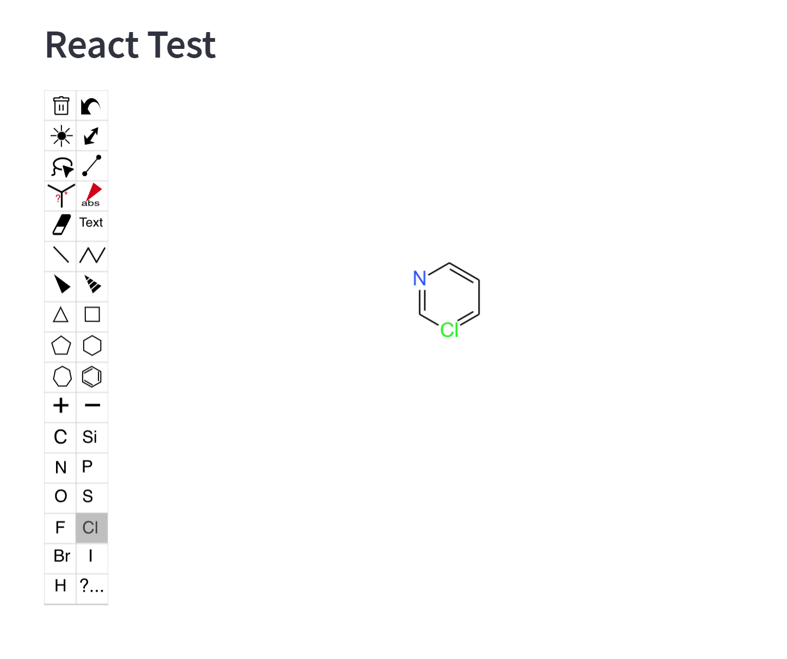

## Quickstart

* Ensure you have [Python 3.10+](https://www.python.org/downloads/), [Node.js](https://nodejs.org), and [npm](https://docs.npmjs.com/downloading-and-installing-node-js-and-npm) installed.
* Clone this repo.
* Create a new Python virtual environment for the template:
```
$ cd template
$ python -m venv venv  # create venv
$ . venv/Scripts/activate   # activate venv
$ pip install streamlit # install streamlit
```
* Initialize and run the component template frontend:
```
$ cd template/react_editor/frontend
$ npm install    # Install npm dependencies
$ npm run start  # Start the Webpack dev server
```
* From a **separate terminal**, run the Streamlit app:
```
$ cd template
$ . venv/Scripts/activate  # activate the venv you created earlier
$ streamlit run react_editor/__init__.py  # run the example
```
* If all goes well, you should see something like this:

